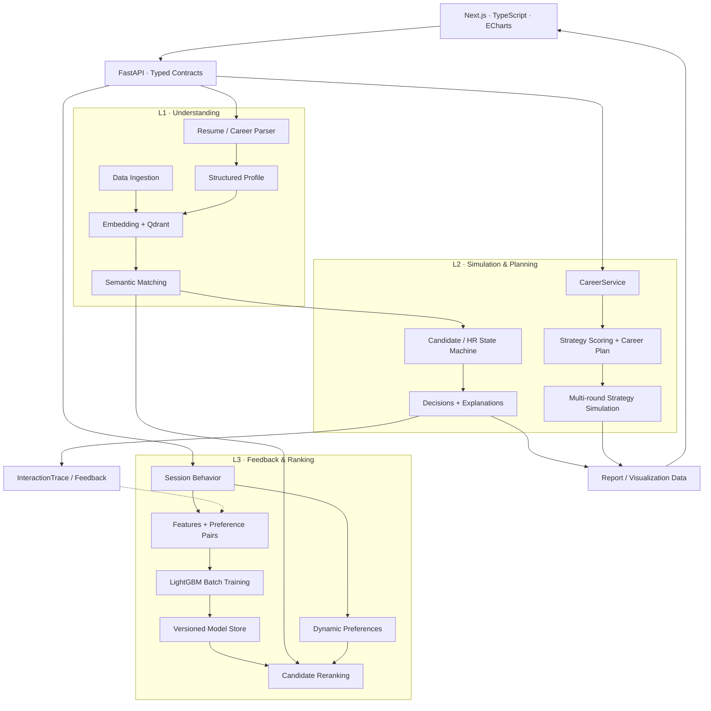

<div align="center">

# AI Career Intelligence

**From Career Signals to Explainable Decisions**

连接职业画像、语义检索、多角色推演与行为反馈的职业智能决策系统。

[](https://www.python.org/)
[](https://fastapi.tiangolo.com/)
[](https://nextjs.org/)
[](https://qdrant.tech/)
[](https://lightgbm.readthedocs.io/)

[技术亮点](#技术亮点) · [系统架构](#系统架构) · [快速开始](#快速开始) · [API 体验](#api-体验) · [工程边界](#工程边界)

</div>

## 项目概述

职业选择涉及多种相互影响的信号：技能与岗位要求的差距、经验与职级的匹配、准备周期、个人偏好，以及不同求职策略的取舍。AI Career Intelligence 将这些信号组织成结构化的分析与推演流程，让推荐结果能够追溯到输入、评分依据和关键决策。

项目围绕 **Understanding → Simulation → Evolution** 构建：从简历和职业事件中提取画像，通过向量检索发现机会，以 Candidate / HR 角色模拟招聘流程，再通过会话行为、偏好更新与排序学习探索持续改进。

当前版本定位为 **可运行的研究与工程原型**，适用于职业决策系统、推荐系统与 Agent 工作流的学习、实验和二次开发。

## 技术亮点

### 01 · 结构化职业理解与语义匹配

- 支持 PDF、Markdown 和纯文本简历输入，结合 LLM 解析、异常时的规则回退及技能归一化，输出 Pydantic 职业数据模型。
- 使用 sentence-transformers 与 Qdrant 实现简历和岗位的向量表示、余弦相似度检索及 Top-K 匹配；匹配结果包含缺失技能，便于解释推荐依据。
- 同时提供 DashScope Embedding 适配器与离线入库脚本，支持围绕不同向量模型开展检索实验。

实现入口：[Parser](backend/parser/) · [Retriever](backend/retrieval/retriever.py) · [JobMatcher](backend/retrieval/matcher.py)

### 02 · 可解释的多角色决策模拟

`CandidateAgent` 根据激进、稳健、均衡三类策略选择投递、准备或转向；`HRAgent` 根据技能、经验和岗位关键词执行筛选。Python 状态机负责推进筛选、面试与 Offer 阶段，并通过步数上限约束执行。

每次模拟保留 `AgentDecision`、状态快照和关键决策，统一输出：

| 输出 | 用途 |
| --- | --- |
| `timeline` / `decision_path` | 展示招聘流程与状态转换 |
| `hr_reasoning` / `candidate_actions` | 解释筛选依据与候选人行动 |
| `skill_gap_chart` / `failure_points` | 定位技能缺口和失败环节 |
| `summary` / `recommendation_cards` | 为前端提供可直接呈现的分析结果 |
| `result` / `metrics` | 保留原始模拟数据与评估结果 |

实现入口：[SimulationEngine](backend/simulation/engine.py) · [响应封装](backend/simulation/final_schema.py)

### 03 · 有约束的职业策略推演

职业分析通过 `CareerService` 提供统一业务入口，内部组织画像解析、策略召回、评分、路径规划、模拟反馈和可视化数据生成。

当前轻量流程将候选策略限制为 **3–5 个**，模拟轮数控制在 **10 轮以内**，并保留基线模板匹配、偏离路径识别、策略多样性评估与动态权重更新。各阶段提供明确的扩展接口，用于后续多用户、多场景和长期趋势研究。

实现入口：[CareerService](backend/career/career_service.py) · [轻量流程](backend/career/t010_pipeline.py) · [策略评估](backend/career/t009_pipeline.py)

### 04 · 从行为信号到 Learning to Rank

排序模块将候选岗位映射为 **8 维特征**：技能重合度、语义相似度、薪资匹配、公司分层启发式评分、召回位置、历史点击率、停留时长与收藏频率。

行为偏好对经过特征构建后，可用于 **LightGBM LambdaRank** 批量训练。训练器提供 NDCG 与 pairwise accuracy 评估逻辑，模型存储模块支持版本管理和激活；在线重排保留原始召回分数，没有可用模型时回退至语义分数。

实现入口：[FeatureBuilder](backend/ranking/feature_builder.py) · [PairBuilder](backend/ranking/pair_builder.py) · [RankingTrainer](backend/ranking/trainer.py) · [ModelStore](backend/ranking/model_store.py)

### 05 · 会话偏好与执行可追溯性

会话层聚合用户行为，以近期会话与历史画像的加权更新维护动态偏好，并计算偏好漂移。反馈队列连接行为事件与后续样本处理；Signal Layer 通过 `InteractionTrace` 记录执行模式、候选结果、模拟结果、训练样本、耗时与错误信息。

编排层定义六种执行模式，支持围绕成本、数据条件和业务目标选择流程：

| 模式 | 主要用途 |
| --- | --- |
| `fast` | 利用缓存结果，缩小模拟范围 |
| `full` | 检索、模拟、审核与反馈的完整流程 |
| `fallback` | 服务降级时使用缓存或简化路径 |
| `ranking` | 特征构建、模型重排与偏好对生成 |
| `session` | 会话聚合、偏好更新与反馈处理 |
| `career` | 职业事件、瓶颈分析与路径推演 |

实现入口：[Pipeline](backend/pipeline/) · [Session](backend/session/) · [Signal Layer](backend/signal_layer/)

### 06 · 面向分析结果的交互界面

前端使用 Next.js 14 App Router、React、TypeScript 与 Zustand，提供职业分析、模拟报告、仪表盘、个人画像和对话页面；通过 ECharts 展示技能雷达、差距图与职业路径，并提供中英文文案及明暗主题。

实现入口：[页面](frontend/app/) · [分析组件](frontend/components/analysis/) · [模拟组件](frontend/components/simulation/) · [职业路径组件](frontend/components/career/)

## 系统架构

下图展示模块职责与主要数据关系；具体执行路径由业务入口和 Pipeline 模式决定。



三个核心设计选择：**用类型模型约束模块输入输出，用显式状态记录决策过程，用可替换组件支持实验迭代。** 当前运行时采用 Python 编排与状态机；早期架构文档中的 LangGraph 等内容属于设计方向。

## 快速开始

### 环境准备

- Python **3.11**：与仓库 Dockerfile 基线一致。
- Node.js **20+** 与 npm。
- 本地模式默认使用内存 Qdrant，无需先启动独立数据库。首次使用本地语义模型时需要下载模型权重。

```bash
git clone https://github.com/54123-phoenix/ai-career-intelligence.git
cd ai-career-intelligence
python -m venv .venv
```

激活虚拟环境，选择对应平台的命令：

```bash
# macOS / Linux
source .venv/bin/activate
```

```powershell
# Windows PowerShell
.\.venv\Scripts\Activate.ps1
```

安装依赖并启动：

```bash
python -m pip install -r requirements.txt
python -m pip install python-multipart httpx
cd frontend
npm ci
npm run dev:full
```

`python-multipart` 用于文件上传，`httpx` 用于模型 HTTP 调用；当前 `requirements.txt` 未显式列出这两项，因此在此补充安装。`dev:full` 会同时启动前后端，后端使用当前终端中的 Python 环境。

| 服务 | 地址 |
| --- | --- |
| Web 界面 | [localhost:3000](http://localhost:3000) |
| Swagger UI | [localhost:8000/docs](http://localhost:8000/docs) |
| OpenAPI Schema | [localhost:8000/openapi.json](http://localhost:8000/openapi.json) |
| 健康检查 | [localhost:8000/health](http://localhost:8000/health) |

前端默认通过 Next.js 将 `/api/v1/*` 代理到本地后端。无云端密钥也可体验规则模拟和演示流程；真实模型解析需要配置相应服务。

### 可选：配置模型服务

参考 [`.env.example`](.env.example) 在仓库根目录创建 `.env`，按需填写：

```dotenv
DASHSCOPE_API_KEY=your-dashscope-api-key
LLM_API_BASE=https://dashscope.aliyuncs.com/compatible-mode/v1
LLM_MODEL=qwen-plus
DASHSCOPE_EMBEDDING_MODEL=text-embedding-v2
```

当前启动脚本不会自动读取根目录 `.env`。需要使用文件配置时，可分别在两个已激活虚拟环境的终端启动：

```bash
# 终端 A：仓库根目录
python -m uvicorn backend.main:app --reload --port 8000 --env-file .env
```

```bash
# 终端 B：仓库根目录
cd frontend
npm run dev
```

也可以将变量直接设置到运行 `npm run dev:full` 的终端环境。默认解析 Provider 在启动时依次选择 DashScope、本地 Ollama 和 Mock；Ollama 适配器默认使用 `qwen2.5:7b`。

常用配置与接入范围：

| 配置 | 当前用途 |
| --- | --- |
| `DASHSCOPE_API_KEY` | DashScope 解析 Provider 与离线 Embedding 适配器 |
| `LLM_API_BASE` / `LLM_MODEL` | 解析 Provider 的服务地址与模型名称 |
| `QDRANT_URL` | 在线向量存储地址；未设置时使用内存模式 |
| `QDRANT_PATH` | 离线入库脚本的本地存储目录 |
| `NEXT_PUBLIC_API_URL` | 前端统一 API 客户端地址，默认 `/api/v1` |

在线 Retriever 当前默认使用 **384 维 MiniLM**；离线入库脚本可选择 DashScope，且使用独立的本地存储路径。接入预计算向量时，需要统一模型、维度与存储连接。

## API 体验

以下示例使用仓库自带的候选人和岗位样本，无需先上传简历或构建向量索引。在 Swagger UI 中也可以直接执行同一请求。

```bash
# Bash / macOS / Linux
curl http://localhost:8000/health
curl http://localhost:8000/api/v1/simulation/samples
curl -X POST http://localhost:8000/api/v1/simulation/run \
  -H 'Content-Type: application/json' \
  -d '{"resume_id":"res-001","job_id":"job-001","strategy":"balanced"}'
```

```powershell
# Windows PowerShell
$body = @{
    resume_id = "res-001"
    job_id = "job-001"
    strategy = "balanced"
} | ConvertTo-Json

Invoke-RestMethod -Uri "http://localhost:8000/api/v1/simulation/run" `
    -Method Post -ContentType "application/json" -Body $body
```

将 `strategy` 切换为 `aggressive` 或 `conservative`，即可比较不同策略下的候选人行动、筛选过程与最终结果。

主要接口：

| 方法 | 路径 | 能力 |
| --- | --- | --- |
| `POST` | `/api/v1/parser/resume` | 上传并解析简历，使用 `multipart/form-data` 的 `file` 字段 |
| `POST` | `/api/v1/career/analyze` | 综合职业分析，请求体包含 `user_input` |
| `POST` | `/api/v1/simulation/run` | 基于样本 ID 运行招聘模拟 |
| `POST` | `/api/v1/pipeline/run` | 运行编排流程 |
| `GET` | `/api/v1/pipeline/modes` | 查看执行模式 |
| `GET` | `/api/v1/trace/{trace_id}` | 查询已记录的交互轨迹 |
| `GET` | `/api/v1/ranking/model/status` | 查看排序模型状态 |

接口字段以运行时 [Swagger UI](http://localhost:8000/docs) 为准；[API 契约文档](docs/api_contracts.md) 可用于理解模块设计与历史接口演进。

## 测试与排序实验

仓库的测试涵盖解析、检索、模拟、职业规划、会话偏好、反馈队列及排序模块。安装测试与可选训练依赖后，在仓库根目录执行：

```bash
python -m pip install pytest pytest-asyncio lightgbm
python -m pytest tests/ -q
```

测试包含 Mock、合成数据与组件集成用例，适合验证行为和接口约束。需要真实岗位数据上的效果评估时，应另行准备数据集、基线与验证划分；本仓库未发布真实招聘结果上的准确率或收益提升基准。

排序训练接受符合 [`RankingPair`](backend/ranking/schemas.py) 模型的 JSONL 数据，每行包含正负岗位及其特征。准备好样本文件后可运行：

```bash
python -m backend.ranking.train_cli --pairs-file data/ranking_pairs.jsonl
python -m backend.ranking.train_cli --list-models
```

`data/ranking_pairs.jsonl` 需自行生成，仓库不附带预训练排序模型。训练、评估与模型版本管理实现位于 [`backend/ranking/`](backend/ranking/)。

## 项目结构

```text
ai-career-intelligence/
├── backend/
│   ├── api/             # HTTP 路由与业务入口
│   ├── parser/          # 简历提取、结构化与技能归一化
│   ├── retrieval/       # Embedding、向量存储与语义匹配
│   ├── simulation/      # Candidate / HR 状态机与解释输出
│   ├── career/          # 职业记忆、策略评估与路径规划
│   ├── ranking/         # 特征、偏好对、LambdaRank 与模型版本
│   ├── session/         # 会话行为、动态偏好与反馈队列
│   ├── feedback/        # 结果审核与训练样本构建
│   ├── signal_layer/    # 交互轨迹与信号封装
│   ├── pipeline/        # 执行模式、流程编排与缓存
│   ├── data_ingestion/  # 数据源抽象与标准化
│   └── shared/          # 共享类型、LLM 适配与回退工具
├── frontend/            # Next.js 应用、图表与领域 API 客户端
├── tests/               # 单元测试与集成测试
├── data/test_resumes/    # 解析测试样本
├── docs/                # 架构、接口与前端设计文档
├── agents/              # 模块职责与开发协作说明
└── tasks/               # 开发任务记录
```

## 工程边界

| 领域 | 当前实现与后续方向 |
| --- | --- |
| 模拟与评分 | Candidate / HR 为规则驱动，策略评分包含启发式与预设参数；概率和置信度是模型内估计，尚未经过真实招聘结果校准。 |
| 数据与状态 | 内置样本和 Mock 数据源用于演示；用户、会话等多处状态存于内存，持久化与生产级认证仍需完善。 |
| 模块接入 | 简历解析返回的 ID 尚未自动注册到样本模拟接口；对话接口当前提供 Mock 文本流。 |
| 学习机制 | 已有偏好更新、排序训练和策略权重迭代代码；自动调度、真实反馈数据与持续评估需要进一步接入。 |
| 扩展能力 | 独立 Market / Interview Agent、多用户群体对比和长期市场情景模拟属于后续扩展方向。 |

欢迎围绕数据源接入、中文检索评估、概率校准、持久化、端到端联调和实验可复现性提交 [Issue](https://github.com/54123-phoenix/ai-career-intelligence/issues) 或 Pull Request。当前仓库尚未指定开源许可证。
