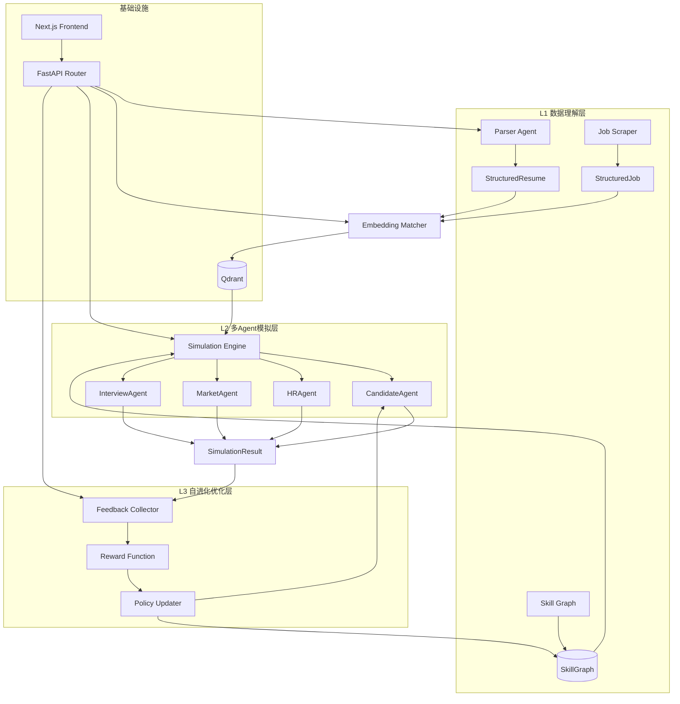

# 系统架构文档

> 由 @architect_agent 维护。任何模块边界变更需更新此文档。

---

## 架构总览



---

## 模块边界

| 模块 | 职责 | 输入 | 输出 | 负责人 |
|------|------|------|------|--------|
| **Parser** | 非结构化数据 → 结构化 | PDF/Markdown/HTML | StructuredResume / StructuredJob | @parser_agent |
| **Retrieval** | 语义检索与匹配 | 结构化数据 | MatchResult[] | @retrieval_agent |
| **Simulation** | 多方博弈模拟 | Candidate-Job Pairs | SimulationResult | @simulation_agent |
| **Evolution** | 策略优化 | SimulationResult | UpdatedParams | @simulation_agent（暂） |
| **API** | HTTP 路由与编排 | HTTP Request | HTTP Response | @architect_agent（契约） |
| **Frontend** | 用户界面 | API 数据 | UI | @frontend_agent |

---

## 数据流

### 主流程：单用户推演

```
[用户上传简历 PDF]
    ↓
POST /api/v1/parser/resume → Parser 解析
    ↓
StructuredResume → POST /api/v1/retrieval/match
    ↓
MatchResult[] (Top-K 岗位)
    ↓
POST /api/v1/simulation/run
    ↓
SimulationResult（含成功概率、策略推荐）
    ↓
Frontend 渲染可视化报告
```

### 反馈流程

```
SimulationResult → FeedbackCollector
    ↓
RewardFunction 评估策略效果
    ↓
PolicyUpdater 调整 Agent 参数
    ↓
更新后的参数写入配置 / Skill Graph 权重更新
```

---

## 技术决策记录

### ADR-001：向量数据库选择 Qdrant

- **考虑**：Milvus, Weaviate, Chroma, Qdrant
- **决定**：Qdrant
- **理由**：
  - 原生 async Python client
  - 轻量，可嵌入式运行
  - 过滤查询性能优秀（skills 标签过滤）
  - 开源，无云 vendor lock-in

### ADR-002：LangGraph 编排模拟流程

- **考虑**：纯 Python asyncio, CrewAI, AutoGen
- **决定**：LangGraph StateGraph
- **理由**：
  - 状态可视化友好（Mermaid 导出）
  - 与现有 LangChain 生态兼容
  - 支持条件分支和人机介入（interrupt）
  - 竞赛/研究场景需要可解释的执行路径

### ADR-003：Next.js App Router + Server Components

- **考虑**：Vue 3, Remix, 纯 React SPA
- **决定**：Next.js 14 App Router
- **理由**：
  - Server Components 减少前端 bundle
  - Server Actions 简化表单提交
  - 内置 API Route（但本项目 backend 独立，不使用 Next.js API）

---

## 目录结构映射

```
ai-career-intelligence/
├── backend/
│   ├── api/              # FastAPI 路由（共享层，需审批）
│   │   ├── routes/
│   │   ├── dependencies/
│   │   └── contracts/    # 接口契约（Architect 维护）
│   ├── parser/           # @parser_agent 领地
│   ├── retrieval/        # @retrieval_agent 领地
│   ├── simulation/       # @simulation_agent 领地
│   └── shared/           # 共享类型与工具（Architect 维护）
├── frontend/             # @frontend_agent 领地
├── docs/                 # 架构文档（Architect 维护）
├── agents/               # Agent Prompt 定义
└── tasks/                # 任务看板
```
